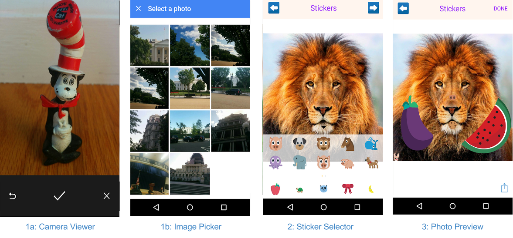
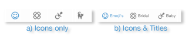
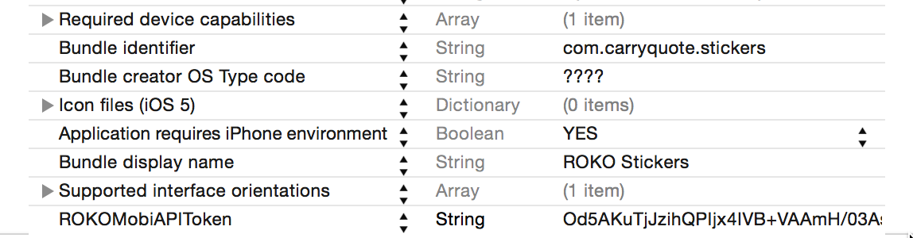
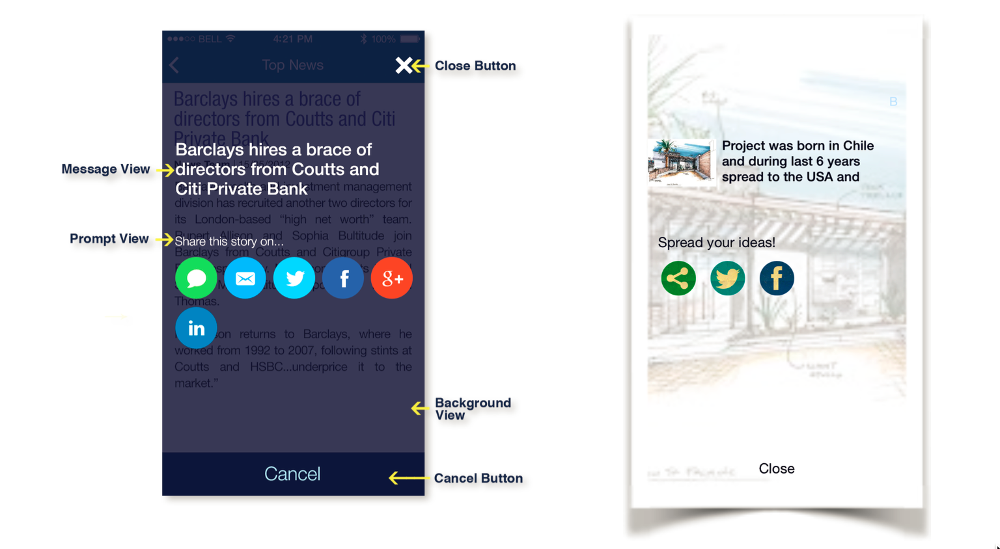
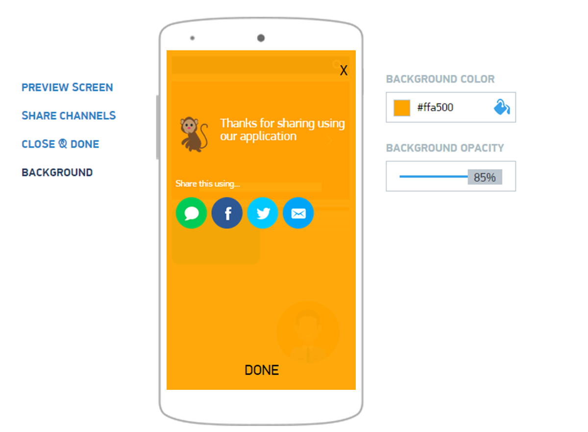

# Roko Mobi Android


*This is a repository of all ROKO Mobi open source Android SDKs. The information below should serve as a usage guide for our Android SDKs. See the table of contents below for a complete list of the content featured in this document.*

|Table of Contents|
-------------------
|[Roko Stickers][stickers]|
|[Roko Share][share]|
|[Roko Push][push]|
|[Roko Analytics][analytics]|
|[Roko StickerPicker][stickerpicker]

[stickers]: #rokostickers-usage-guide
[share]: #rokoshare-usage-guide
[push]: #rokopush-usage-guide
[analytics]: #rokoanalytics-usage-guide
[stickerpicker]: #rokostickerpicker-usage-guide

## ROKOStickers Usage Guide

The ROKOStickers framework provides a means for taking photos, dressing them up in stickers, and sharing the results with the world through FB, Twitter, e-mail, or sms.

### Prerequisites

1) ROKOStickers framework requires Android Sdk Version 11  or later.

2) Install Eclipse or Android Studio.

###Configure your Android Project

There are two ways to build your Android project: Eclipse  or Android Studio.

#### Eclipse

1) import RokoShare and RokoStikers Framework files:

```
[File]->Import->General->Existing Projects into Workspace->Browse->Select [RokoMobi]
```


---

2) Add this android Library as dependency to your application project: 

```
RokoMobi
```
---
3) Add required permissions and the sticker activity to your AndroidManifest.xml
```
    <uses-permission android:name="android.permission.INTERNET" />
    <uses-permission android:name="android.permission.WRITE_EXTERNAL_STORAGE" />
    <uses-permission android:name="android.permission.ACCESS_NETWORK_STATE" />
    <uses-permission android:name="android.permission.READ_PHONE_STATE" />
    <uses-permission android:name="android.permission.ACCESS_WIFI_STATE" />

        <activity
            android:name="com.rokomobi.sdk.StickersActivity"
            android:screenOrientation="portrait"
            android:theme="@android:style/Theme.Translucent.NoTitleBar" >
            <intent-filter>
                <action android:name="com.rokolabs.rokostickers.PICK_PHOTO" />
                <action android:name="com.rokolabs.rokostickers.TAKE_PHOTO" />
                <category android:name="android.intent.category.DEFAULT" />
            </intent-filter>
        </activity>

```
---
4) Init RokoMobi in your application or activity's onCreate
```
RokoMobi.start(this);
```


###Creating photos with ROKOStickers



Figure #1. ROKOStickers WORKFLOW

The code examples in this page demonstrate how to fine-tune and display the photo composer, as well as customize it with your own branded sticker packs.
Integrating ROKOStickers you may choose among several starting points:

####1) Display the View Activity

* User can take a new photo by invoking the camera
* Or user can get images from their camera roll using the Image Picker

On call this sticker activity with two buttons (call it takePhotoButton and choosePhotoButton). Then connect them with apporopriate functions in this activity. 


```Java
- private void startPickPhoto() {       
	Intent intent = new Intent(StickersActivity.ACTION_PICK_PHOTO);
    startActivity(intent);
}

- private void startTakePhoto() {       
	Intent intent = new Intent(StickersActivity.ACTION_TAKE_PHOTO);
    startActivity(intent);
}
```

####2) Configure ROKOStickers' behavior & content:


You may chose to register your project on ROKO Mobi Portal, which provides easy-to-use GUI, or to configure the ROKOStickers framework and manage it¡¯s content. If you do so, you may skip the following section. Alternatively you may chose to manage the ROKOStickers independently, in this case the following section is a guide for you.

#####a) Customize Composer View appearance.

set StickersActivity.KEY_CUSTOMIZE_UI variable before you start RokoStickers Activity

```Java
- private void startRokoStickersActivity() {       
	Intent intent = new Intent(StickersActivity.ACTION);
	intent.putExtra(StickersActivity.KEY_CUSTOMIZE_UI, true);
        startActivity(intent);
}
```

Copy stickers_settings.json from RokoStickers/assets/stickers_settings.json to your target project,and change it's content to customize your own vision of appearance.

Customize your own vision of appearance

```Java
- {
    "apiStatusCode": "Success",
    "data": {
    	......        
        "albumName": "Stickers",
        "navigationBar": {
            "useTextForButtons": true,
            "leftButtonText": "Back",
            "rightButtonText": "Next",
            "buttonFont": {
                "size": 16,
                "color": "155, 48, 255"
            },
            "leftButtonImageFileGroup": { ...},
            "rightButtonImageFileGroup": {...},
            "title": "Stickers",
            "titleFont": {
                "size": 22,
                "color": "155, 48, 255"
            },
            "backgroundColor": "255, 245, 238"
        },
        "tray": {
            "font": {
                "size": 18,
                "color": "0, 0, 0"
            },
            "displayType": "iconOnly",
            "closeButtonImageFileGroup": {...},
            "openButtonImageFileGroup": {...},
            "backgroundColor": "135, 255, 255, 255"
        }
    }
}
```


#####b) provide sticker packs content from local resources:

set StickersActivity.KEY_CUSTOMIZE_STICKERS variable before you start RokoStickers Activity

```Java
- private void startRokoStickersActivity() {       
   Intent intent = new Intent(StickersActivity.ACTION_PICK_PHOTO);
        intent.putExtra(StickersActivity.KEY_CUSTOMIZE_STICKERS, true);
        intent.putExtra(StickersActivity.KEY_CUSTOMIZE_STICKERS_DATA, (Serializable) getPackageInfos());
        startActivity(intent);
}

Create sticker packs for local resources. Make sure you add Resource  to your project folder "res/drawable-xhpi":


```Java
- private List<StickerPackInfo> createPackageInfos()   {
        List<StickerPackInfo> packageInfos = new ArrayList<StickerPackInfo>();

        StickerPackInfo p1 = new StickerPackInfo();
        p1.title = "baby";
        p1.iconDefault = R.drawable.baby_icon_default;
        p1.iconSelected = R.drawable.baby_icon_selected;
        p1.stickerInfos.add(R.drawable.baby_1);
        p1.stickerInfos.add(R.drawable.baby_2);
        p1.stickerInfos.add(R.drawable.baby_3);

        StickerPackInfo p2 = new StickerPackInfo();
        p2.title = "cake";
        p2.iconDefault = R.drawable.cake_icon_default;
        p2.iconSelected = R.drawable.cake_icon_selected;
        p2.stickerInfos.add(R.drawable.cake_1);
        p2.stickerInfos.add(R.drawable.cake_2);
        p2.stickerInfos.add(R.drawable.cake_3);

        packageInfos.add(p1);
        packageInfos.add(p2);

        return packageInfos;
    }
```


#####c) Provide sticker packs content from ROKO Portal:

Start with creation two meta-data on your AndroidManifest.xml.

|Key|Value|
---|---
|ROKOMobiAPIURL|api.roko.mobi/external/v1|
|ROKOMobiAPIToken|<a href="https://portal.roko.mobi/settings" target="_blank">%YOUR_API_FROM_SERVER%</a>|

Declare and initialize instance variable dataSource, before start rokosticker activity ,
if StickersActivity.KEY_CUSTOMIZE_STICKERS = false ,get stickers data from portal, and will
load data from portal,
if StickersActivity.KEY_CUSTOMIZE_UI = false, get stickers ui setting from portal.

```Java
- private void startRokoStickersActivity() {       
   Intent intent = new Intent(StickersActivity.ACTION_PICK_PHOTO);
        intent.putExtra(StickersActivity.KEY_CUSTOMIZE_STICKERS, true);
        intent.putExtra(StickersActivity.KEY_CUSTOMIZE_STICKERS_DATA, (Serializable) getPackageInfos());
        startActivity(intent);
}
```


Note:

1) you may provide scale factor for the watermark from 0.1 to 1. Default is 1.

#####d) Further customization:

Display sticker packs as:

```
ROKOStickersTrayDisplayTypeIconOnly,
ROKOStickersTrayDisplayTypeTitleOnly,
ROKOStickersTrayDisplayTypeTitleAndIcon
```



Use

```Json
- {
	....
        "tray": {
            "displayType": "iconOnly",
           ....
        }
    }
}
```

##ROKOShare Usage Guide

###Before You Begin:

1) ROKOShare framework requires Android Sdk Version 11  or later.

2) Install Eclipse or Android Studio.


###Configure your Android Project

There are two ways to build your Android project: Eclipse  or Android Studio.


####1) import RokoShare and RokoStikers Framework files:

```
[File]->Import->General->Existing Projects into Workspace->Browse->Select [RokoMobi]
```
---

####2) Add this android Library as dependency to your application project: 

```
RokoMobi
```
---
####3) Add required permissions to your AndroidManifest.xml
```
    <uses-permission android:name="android.permission.INTERNET" />
    <uses-permission android:name="android.permission.WRITE_EXTERNAL_STORAGE" />
    <uses-permission android:name="android.permission.ACCESS_NETWORK_STATE" />
    <uses-permission android:name="android.permission.READ_PHONE_STATE" />
    <uses-permission android:name="android.permission.ACCESS_WIFI_STATE" />


```
---
####4) Init RokoMobi in your application or activity's onCreate
```
RokoMobi.start(this);
```

####5) Generate the API Token by registering your project on ROKO Mobi Portal. Add ?ROKOMobiAPIURL?, ?ROKOMobiAPIToken? meta-data on your AndroidManifest.xml.




###Sharing Content with ROKOShare

The ROKOShare framework provides a means to share rich content from your app into the sms, e-mail, Twitter, and Facebook, including text, photos, and URL attachments. The code examples in this page demonstrate how to customize and display the sharing dialog, as well be informed about posting results within your app.

####1) Init ROKOShare and get ShareSetting

To integrate ROKOShare in your application, get an instance of ROKOShare and get the ShareSetting:

```Java
ROKOShare rokoShare = ROKOShare.getInstant(StickersActivity.this);
ShareSettings shareSettings = rokoShare.getShareSettings();
```

####2) Provide the message, image, video, and/or URL to be shared:

```Java
	shareSettings.setMessageBody("");
    shareSettings.preview.previewUri = Uri.fromFile(new File(previewFile));
    shareSettings.preview.fileUri = Uri.fromFile(new File(fileToSend));

```
Note: ROKOShare framework offers the option of using two different messages: 

- display message: to be displayed in the view controller¡¯s ?Message View? (please refer to the image in ?Customize ROKOShare appearance? section), set via shareSettings.preview.staticText:

- share message: to be actually shared via social services, set via shareSettings.setMessageBody:.


###Customizing ROKOShare Appearance:

ROKOShare appearance is highly customizable. 



There are two ways to customize standard view: 

- use ROKO Mobi portal where you could customize view in friendly interface

- transform the standard view to a custom one with just a few lines of code

If you are using ROKO Mobi Portal to customize ROKOShare, all you need is login to the portal, go to the **Share - Settings** section and tune view appearence on your taste. 



In this case you may skip the following sections

###Customizing view from your code

####1) Customizing ?Background View?:

You may change: - background color; 
To do that implement the following code:

```Java
ROKOShare rokoShare = ROKOShare.getInstant(StickersActivity.this);
ShareSettings shareSettings = rokoShare.getShareSettings();
shareSettings.backgroundColor = "235, 211, 211, 211";//comma separated rgb/argb array.
```

####2) Customizing ?Prompt View?:

You may change: - text color - title
To do that implement the following code:

```Java
    sharesettings.preview.promptText = "Share this story on...";
    sharesettings.preview.promptTextFont.size = 12;
    sharesettings.preview.promptTextFont = "255, 255, 255";
```

####3) Customizing ?Message View?:

You may change: - text color - text  

```Java
    sharesettings.preview.staticText = "Share this story on...";
    sharesettings.preview.staticTextFont.size = 12;
    sharesettings.preview.staticTextFont = "255, 255, 255";
```

####4) Customizing ?Close Button? & ?Cancel Button?:

You may provide the following parameters specifically for 

- text color 
- title
- image
- font

To do that implement the code below. Please note that the same code applies to ?Cancel Button? To do that implement the following code:

```Java
sharesettings.navigation.useTextForCloseButton = true;
sharesettings.navigation.closeButtonEnabled = true;
sharesettings.navigation.closeButtonText = "CLOSE";
sharesettings.navigation.closeButtonTextFont.size = 16;
sharesettings.navigation.closeButtonTextFont.color = "255, 255, 255";
sharesettings.navigation.doneButtonEnabled = true;
sharesettings.navigation.useTextForDoneButton = false;
Drawable close = getResources().getDrawable(R.drawable.ic_close);
sharesettings.navigationScheme.closeButtonDrawable = close;
```

####5) Customize sharing services:

You may change:
- the order the services are displayed on screen
- image for each service

```Java
Channel twitterChannel = new Channel();
twitterChannel.channelType = ShareSettings.CHANNEL_TWITTER;
twitterChannel.enabled = true;
twitterChannel.bodyText = "shared in twitter";
twitterChannel.imageDrawable = getResources().getDrawable(R.drwable.twitter);
Channel fbChannel = new Channel();
fbChannel.type = ShareSettings.CHANNEL_FACEBOOK;
fbChannel.enabled = true;
fbChannel.bodyText = "shared in facebook";
fbChannel.imageDrawable = getResources().getDrawable(R.drwable.twitter);
sharesettings.channels = new ArrayList<Channel>();
sharesettings.channels.add(twitterChannel);
sharesettings.channels.add(fbChannel);
```

## ROKOPush Usage guide

ROKOPush is a simple component that allows you to handle Push Notifications.

### Subscribe to push notifications from ROKO Portal
1) Add ROKOMobiGCMSenderID meta-data to your application in AndroidManifest.xml
```
        <meta-data
            android:name="ROKOMobiGCMSenderID"
            android:value="970843798000" />
```

2) Add permission and receiver to your AndroidManifest.xml
```
    <!-- Only this application can receive the messages and registration result -->
    <permission
        android:name="com.rokolabs.rokostickers.permission.C2D_MESSAGE"
        android:protectionLevel="signature" />

    <uses-permission android:name="com.rokolabs.rokostickers.permission.C2D_MESSAGE" />
    <uses-permission android:name="com.google.android.c2dm.permission.RECEIVE" />
    <uses-permission android:name="android.permission.READ_CONTACTS" />
    <uses-permission android:name="android.permission.GET_ACCOUNTS" />
    <uses-permission android:name="android.permission.WAKE_LOCK" />
    
        <receiver
            android:name="com.rokomobi.sdk.push.GCMReceiver"
            android:permission="com.google.android.c2dm.permission.SEND" >
            <intent-filter android:permission="com.google.android.c2dm.permission.SEND" >
                <action android:name="com.google.android.c2dm.intent.RECEIVE" />

                <category android:name="com.rokolabs.rokostickers" />
            </intent-filter>
            <intent-filter android:permission="com.google.android.c2dm.permission.SEND" >
                <action android:name="com.google.android.c2dm.intent.REGISTRATION" />

                <category android:name="com.rokolabs.rokostickers" />
            </intent-filter>
        </receiver>
        <service android:name="com.rokomobi.sdk.push.GCMIntentService"></service>        
    
````

### Handle ROKO Notifications

You can use a very simple API call to register a listener for notification

```Java
		ROKOPush.setPushLisener(new OnPushMessageListener() {
			
			@Override
			public void onPushMessage(Context ctx, Intent data) {
				
			}
		});
```

## ROKOAnalytics Usage Guide
ROKOLogger is the main class with the only significant method:
```Java
	/**
	 * Sends analytic event to ROKO Analytics. Stores message in local db if
	 * server is not avaliable
	 * 
	 * @param events
	 *            events to send
	 */
	public static void addEvent(Event... events)
```
To add an Event. Sample:
```Java
	ROKOLogger.addEvent(new Event("_ROKO.Stickers.Open"));
```
The example above sends event with name "_ROKO.Stickers.Open" without additional parameters.

To optimize traffic events are packed in batches. Batches are sending when the size of the current batch is growed up to 50 events or 5 seconds elapsed since the last sending. Also every batch contains basic information about device: model, operating system etc.

## ROKOStickerPicker Usage Guide

You can create the Sticker Picker fragment and add to the layout in your application, and get the selcted sticker via OnStickerPickedListener callback.
```Java
		//Create the StickerPicker fragment
		Fragment picker = RokoMobi.createStickerPicker(this,
				new OnStickerPickedListener() {

					@Override
					public void onStickerPicked(File imageFile, Sticker data) {
						//handled the sticker picked
						//image.setImageURI(Uri.fromFile(imageFile));
					}
				});

		//Add the fragment to your layout
		getFragmentManager().beginTransaction().replace(R.id.picker, picker)
				.commit();
```
